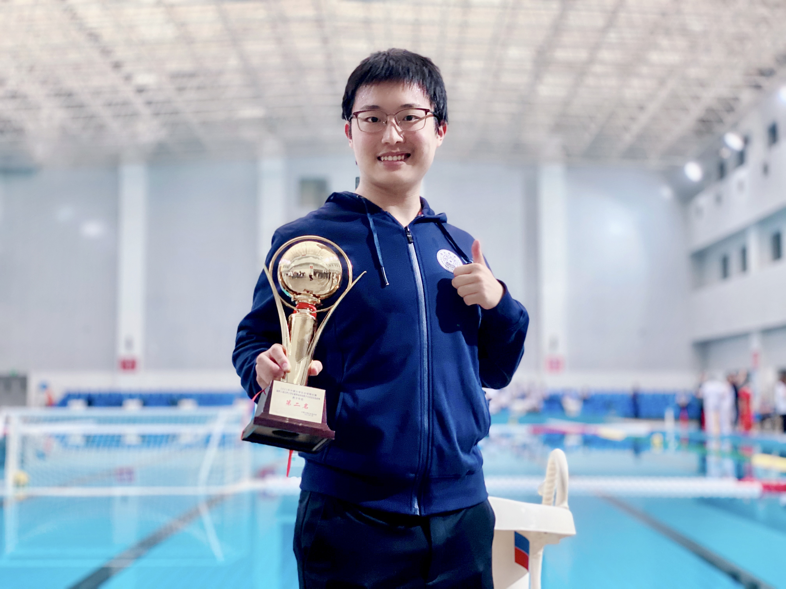
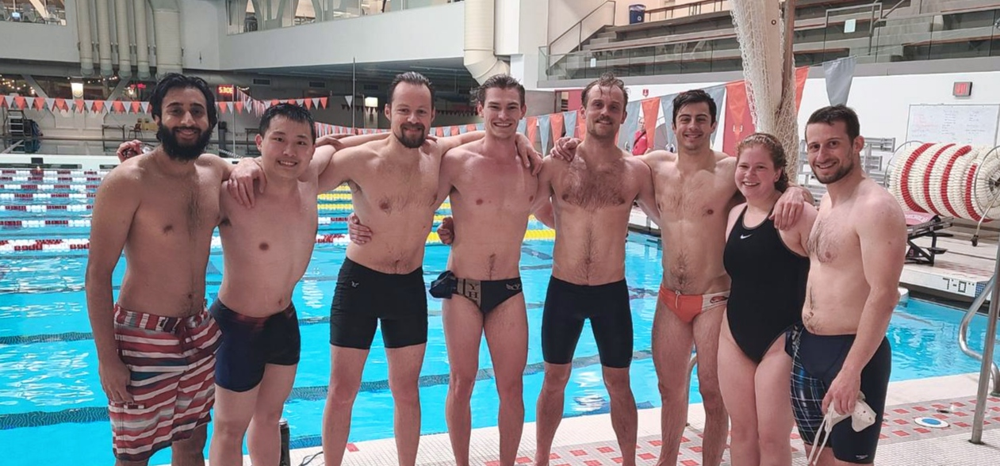

I became a water polo player in our university team since my freshman year. We won 2nd place in the National Collegiate Water Polo Championships in 2021!

When visiting MIT in Spring 2023, I competed in the MIT Intramurals Water Polo League (IM League) --- our team won the first!

Besides water polo, I enjoy swimming as well. In the Tsinghua Swimming Competition (马约翰杯游泳比赛 in Chinese), I won 1st place in men's 100m butterfly, 3rd place in men's 200m medleys, and 5th place in men's 200m freestyle.

I am also the founder & manager of our institute's [swimming club](https://iiis.tsinghua.edu.cn/index.php?v=show&cid=670&id=9386) and swimming team!
